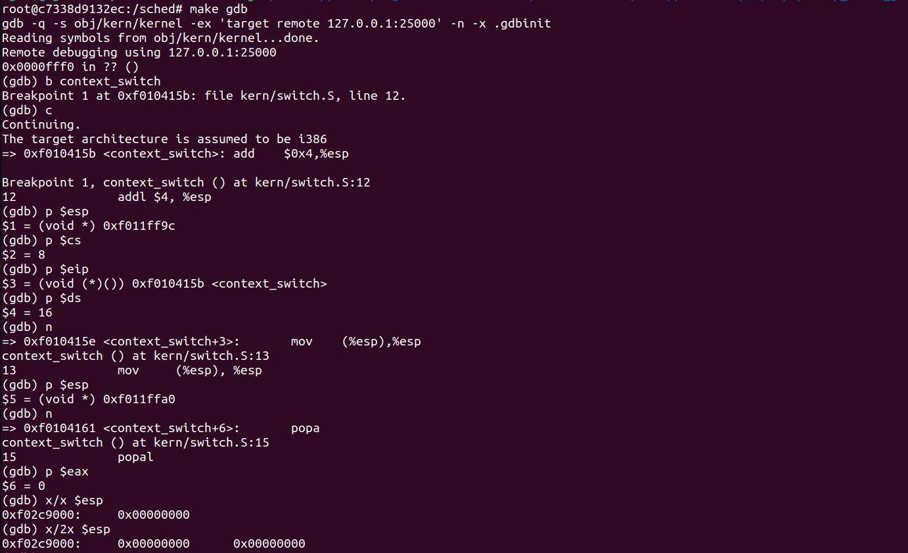
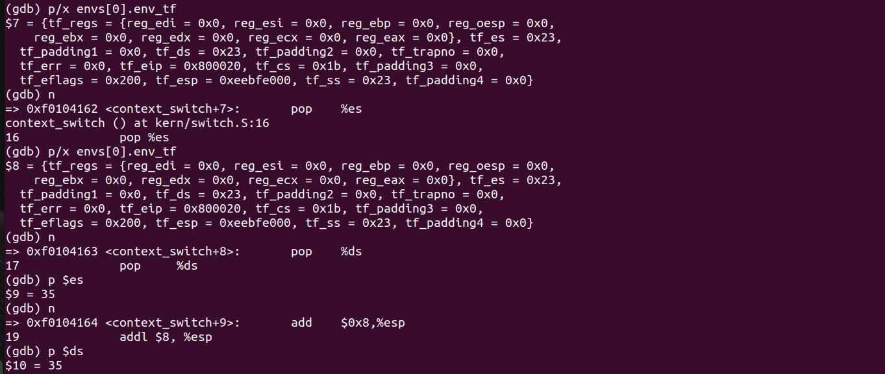
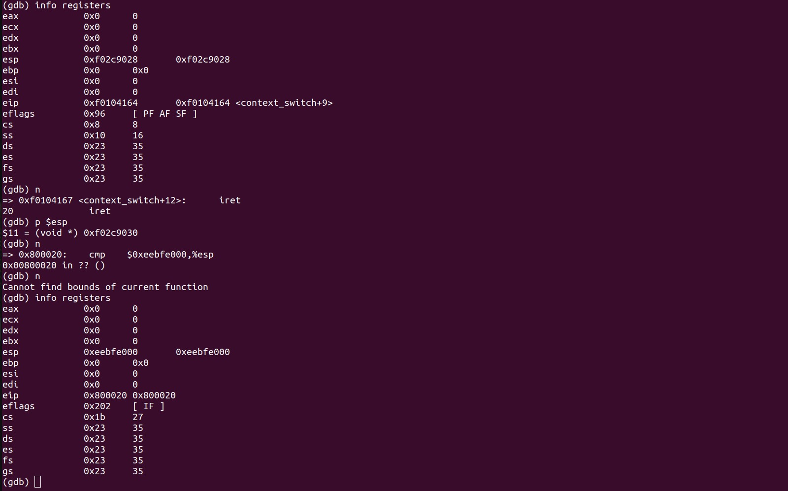

# TP2: Scheduling y cambio de contexto

## Parte 1
Utilizar GDB para visualizar el cambio de contexto. Realizar una captura donde se muestre claramente:

- El cambio de contexto
- El estado del stack al inicio de la llamada de `context_switch`
- Cómo cambia el stack instrucción a instrucción
- Cómo se modifican los registros luego de ejecutar `iret`

 Utilizando el depurador GDB junto con QEMU, se examino `context_switch` e `iret`, fundamentales para el cambio de contexto. Se inspeccionaron los registros de la CPU, confirmando una transición exitosa al modo usuario mediante valores de registros de segmento.
 A continuación podemos ver en detalle el paso a paso de lo realizado:

## Parte 3
# Explicación de la lógica de implementación en el scheduler por lotería

Lotery Scheduling, es uno de los métodos de planificación que implementamos, el cual asigna prioridades a los procesos mediante un sistema de "tickets". Cada proceso en cola para ejecución recibe un número de tickets que determina su probabilidad de ser seleccionado para ejecutarse. Mientras mayor cantidad de tickets tenga un proceso, mayor prioridad tiene ya que tiene más chances de ganar la lotería. 

El proceso de Lotería se lleva a cabo de la siguiente manera:

1. **Cálculo de Tickets Totales:**
   - Se itera el array envs sumando el número de tickets de todos los procesos en estado `ENV_RUNNABLE` para obtener el total de tickets disponibles.
   - Si la cantidad de tickets totales es 0 es porque no hay procesos listos para correr. Si el proceso corriendo actualmente terminó, se llama a sched_halt

2. **Selección Aleatoria del Ganador:**
   - Se genera un número aleatorio dentro del rango de tickets totales, que actúa como "ticket ganador".

3. **Asignación del Proceso Ganador:**
   - Se itera el array de procesos nuevamente. Se mantiene una variable que cuenta cuantos tickets ya se leyeron para calcular que tickets tiene el proceso actual. De esta manera si el primer proceso tenía 10 tickets, se       considera al primer ticket del segundo proceso como el ticket 11.
4. **Ejecución del Proceso Seleccionado:**
   - El proceso elegido se ejecuta, cambiando el contexto de ejecución del CPU para comenzar su ejecución.

- Si no hay procesos ENV_RUNNABLE en el sistema o si el proceso actual en ejecución ya no es ENV_RUNNING, el sistema se detiene. Esto garantiza que el sistema no se quede inactivo indefinidamente. 

Además, se implementaron dos syscalls adicionales que permiten interactuar con el sistema de tickets:

- **sys_get_prioridad:** Recibe un proceso y devuelve la cantidad de tickets que tiene
  
- **sys_cambiar_prioridad:** Recibe un proceso y un número que indica la cantidad de tickets que se desea asinar al proceso. Si la cantidad recibida es menor a la cantidad de tickets actual o mayor a 1 modifica la cantidad de tickets del proceso con la cantidad indicada.

-Cabe mencionar que si se hace un **fork** el hijo tiene la misma cantidad de tickets que el padre 

